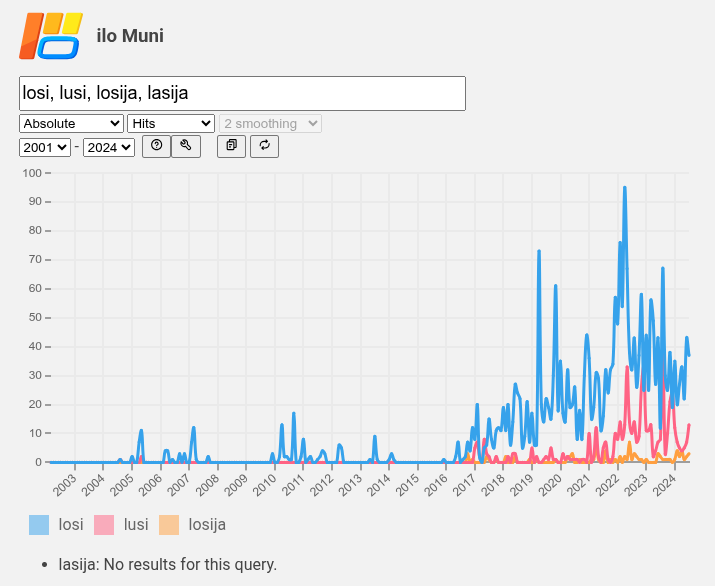
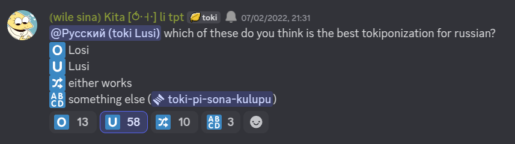
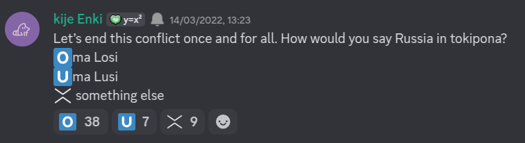
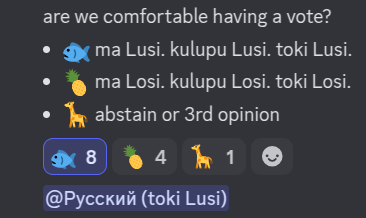

## tl;dr

* In the 2000s, speakers converged on **ma Losi** for Russia, **toki Losi** for the Russian language.
* The preference today is to use **ma Lusi** and **toki Lusi**.
* A small minority of Toki Pona speakers prefer to decouple country and language names. If you prefer that, please use **ma Lasija** for Russia.
* Outside one specific situation, **ma Losija** is a slightly poor tokiponisation.

***

## Russia(n) in Russian

By convention, Toki Pona derives proper names from endonyms, while keeping the country and language name unified. To make the name for Russia(n) in Toki Pona, we must first take a look at those words in Russian:

* [Росси́я](https://en.wiktionary.org/wiki/%D0%A0%D0%BE%D1%81%D1%81%D0%B8%D1%8F#Russian) <code>[rɐˈsʲijə]</code> -- Russia.
* [ру́сский](https://en.wiktionary.org/wiki/%D1%80%D1%83%D1%81%D1%81%D0%BA%D0%B8%D0%B9#Russian) <code>[ˈruskʲɪj]</code> -- Russian (language, ethnicity, etc).[^1]

There are numerous ways to tokiponise these two words, but two versions are most notable:
* The name *Losi* was first used in the early 2000s, and appears in the [2014 proper names](https://jan-ne.github.io/tp/names) list.
* The version *Lusi* started appearing in 2016 and became rather popular in 2022 onwards. It is still in the minority by total mentions, but the majority of Russian speakers prefer it.

Both are <u>good enough</u> for regular conversation, and will be understood. However, there is value in explaining why this happened, and making recommendations.

## Reasons for change

What caused Russian speakers to turn to a different name for Russia(n)?  
In general, *Losi* seems odd in a couple of ways:

### 1. Where did the [o] come from?

Neither the word 'русский' nor the word 'Россия' features an [o] sound. The spelling of 'Россия' uses the letter 'o', and indeed the underlying phoneme would be /o/, were it stressed. Let's examine some possible explanations for why *Losi* originally featured an [o]:

1. Perhaps spelling is meant to win over pronunciation. Other examples of tokiponisation tell us this was not the thinking at the time, e.g. *ma tomo Towano* for Toronto.
2. The vowel [o] was chosen as an average between the [ɐ] of 'Россия' and the [u] of 'русский', as a strategy to unify the language and country name. This is still odd, considering the same was not done to *Posuka* (Poland/Polish) or, heck, *Inli* (England/English).
3. Early tokiponists did not bother to notice vowel reduction in Russian, and assumed the spelling is one-to-one with pronunciation. If that were the case, Russian speakers are justified in using a different form, as they know better.

### 2. Where did the third syllable go?

Some people are puzzled that *Losi* is not *Losija*, which would be a more complete tokiponisation of 'Россия'. I think this logic is shaky: since the language name does not have *-ja*, it's fine for the unified name to lack *-ja*, actually.

Some country names in the 2014 list, like *ma Italija*, *ma Intonesija*, also keep *-ja*. However, notice that their language names -- *italiano*, *bahasa indonesia* -- also include the suffix, so it is not jarring to keep it in the unified name. The only counterexample I found was *ma Maketonija*, the language name *makedonski* does not have *-ja*.

Some people prefer to un-merge language and country names, in which case including *-ja* is justified. However, pay attention to the vowel pronunciation! *ma Lasija* makes more sense than *ma Losija*.[^2]

### 3. Moose 🫎

The word 'losi' already exists in Russian and means [moose (plural)](https://en.wiktionary.org/wiki/%D0%BB%D0%BE%D1%81%D0%B8). Some find that endearing, others frustrating. Ultimately it doesn't really matter, but it highlights that Russians see *ma/toki Losi* and immediately think of something unrelated.

### So what went wrong?

Russian speakers expect the tokiponisation to resemble either the language name or the country name, and *Losi* has peculiarities that make it mismatch both (and instead it makes us think of meese). This is different from most other names, where at least the country name *or* the language name feels fitting.

*Lusi* directly tokiponises the language name, which avoids all three of these pitfalls. Additionally, it resembles a tokiponisation of [Rus'](https://en.wikipedia.org/wiki/Kyivan_Rus'), the medieval state, ethnic group, and predecessor of modern day Ukraine, Russia, and Belarus.[^3]

## How many times have people used Losi and Lusi?

[ilo Muni](https://ilo.muni.la) is a corpus tool by [mun Kekan San](https://mun.la) that lets you search for words in a huge dataset of Toki Pona texts, ranging from its inception to recent times. Let's [compare](https://ilo.muni.la/?query=losi%2C+lusi%2C+losija%2C+lasija%2C+lasija&minSentLen=1&scale=abs&field=hits&start=996624000&end=1722470400) how many times these tokiponisations of Russia(n) have appeared in real conversations and texts:

The 2001-2016 range represents our early data, comprised mostly of forums. These are quite sparce, as the community was orders of magnitude smaller than it is today. Before 2016, *Losi* is more or less the only option in use.

Data from 2017 onwards includes Reddit and Discord, which are huge. 90%+ of all Toki Pona ever documented belongs to this period. Here you see the appearance and gradual adoption of *Lusi*, although it is yet to become more common than *Losi*.

## Which one should we recommend?

For the most part, it's *fine* that more than one tokiponisation is actively in use. There are, however, occasional circumstances where a choice has to be made:
* When technology is involved, such as translating locales for websites and games
* When teaching is involved, such as when demonstrating recommended tokiponisations to beginners
* Some combination of both, such as article names on Wikipesija

For circumstances like those, several people have tried to survey people on ma pona to see which they prefer. The important thing about polling, however, is that results will vary greatly depending on (a) who you survey and (b) how you phrase your survey question. Compare these two polls:

The results swing in completely opposite directions, but this is actually entirely expected:
1. Kita's poll asks about 'Russian', while Enki's poll asks about 'Russia'. *Lusi* is easily identified specifically with the language, while *Losi* (though missing a *-ja*) is clearly more of a country name option.
2. Kita's poll asks about preference, while Enki's poll reads like it's about practice. The latter primes respondents to answer *Losi*, because it was at the time the established and mostly undisputed option.
3. Kita asked specifically Russian speakers, while Enki left that implicit. (Of course, this is Discord, and in practice *anyone* could respond regardless.)

In 2025, we got a more balanced poll by jan Sonja, albeit with a smaller sample size:

The results were 7-3. You can see the reasoning of several people who preferred Lusi below, both from this poll and from random conversations in the years prior.

The people who voted Losi did not offer an explanation. However, from other conversations we can see it's largely inertia -- Losi was offered consistently in many past resources. Plenty of people will simply take those for granted.

## Testimonials of Russian-speakers

> also why is Russia called ma Losi not ma Losija  
> (@ap5)  
> I would say it comes from russkij but then it would be Lusi  
> (@nateenate., 2020-04-13)

> also  
> I wonder why it's Losi and not Losija  
> "россия" has 3 syllables  
> and "русский" is closer to "lusi" tawa mi  
> (@the_whatevers, 2020-10-31)

> losi just makes no sense  
> (@tabbyofglue, 2022-02-07)

> if we are to pick one word, it should be lusi  
> (@teradex124, 2022-02-07)

> will i be frowned upon if use "toki Lusi" instead of "toki Losi" :D  
> (@dongseonga, 2023-12-21)

> Why is Russian toki Losi?  
> Wouldn't something like toki Lusi work better?  
> (@wefailedgeography, 2024-10-20)

> nimi Lusi li tan nimi toki (русский/russkij). ni li pona a  
> (@mikijeenki, 2025-06-07)

> nothing against Losi and it's cute, but imo Lusi is just better  
> (@glimmur, 2025-06-07)

Several people above expressed a preference for *Lusi*; some offered other options, including *Losija*, *Luki*, *Lusiki*.

[^1]: Russian also has words related to Russian statehood and citizenship -- [росси́йский](https://en.wiktionary.org/wiki/%D1%80%D0%BE%D1%81%D1%81%D0%B8%D0%B9%D1%81%D0%BA%D0%B8%D0%B9#Russian), [россия́нин](https://en.wiktionary.org/wiki/%D1%80%D0%BE%D1%81%D1%81%D0%B8%D1%8F%D0%BD%D0%B8%D0%BD). These are good to know about, but they are irrelevant for Toki Pona. Instead of requiring tokiponisation, you should break down their meaning. For example, *jan pi ma Lusi* vs *jan pi kulupu Lusi*.

[^2]: Although Россия usually has [ɐ], [Northern Russian dialects](https://en.wikipedia.org/wiki/Northern_Russian_dialects) preserve unstressed [o]. For those speakers, it is absolutely reasonable to use /o/ in the tokiponisation. Nevertheless, speakers who preserve this feature are a fairly small minority today, and should not affect our general case.

[^3]: *Lusi* resembles *Rus'* -- is that even a good thing? Does it contribute to the nationalistic sentiment that the shared East Slavic heritage belongs foremost to Russians, at the expense of Ukrainians and Belarusians? I certainly don't intend it that way when I refer to modern day Russia as *ma Lusi*, but the possibility of such a misunderstanding is always present. Nevertheless, it's the natural consequence of modern day Russians using the same endonym as the medieval ethnicity.
